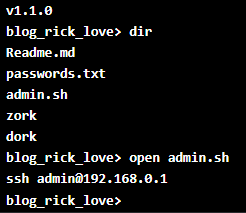
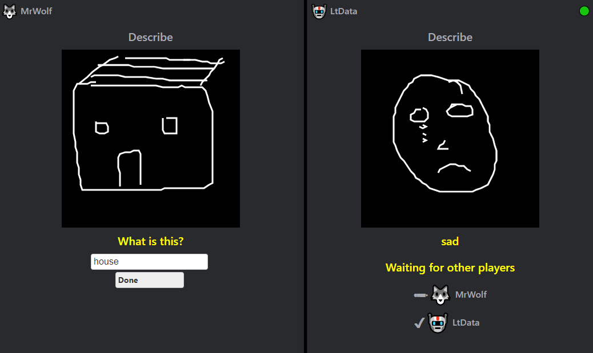
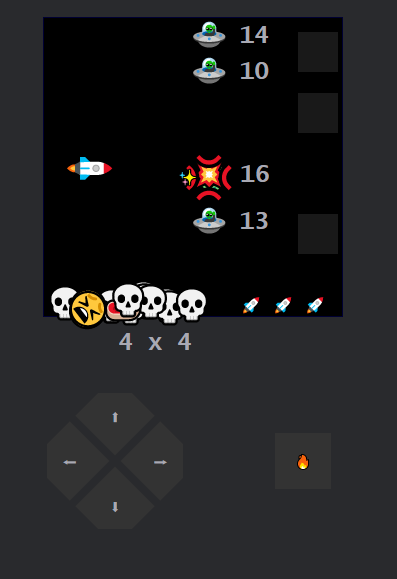
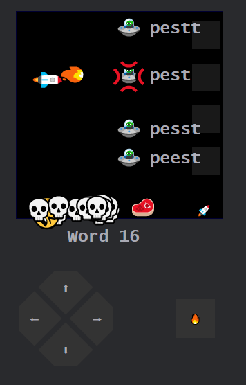
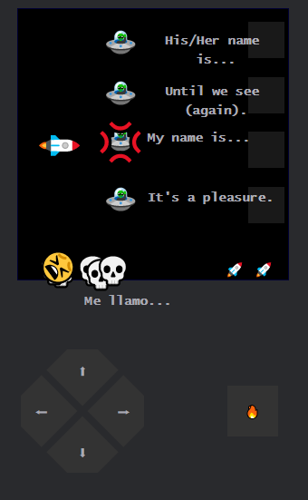
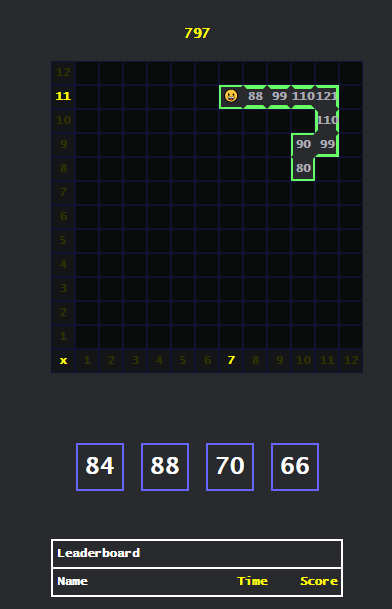
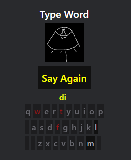
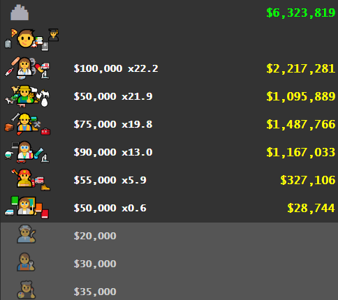
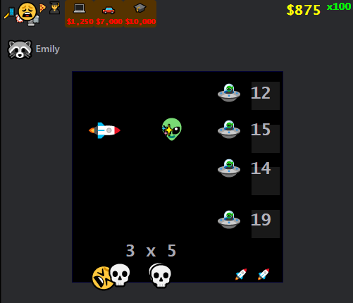

So, almost all my content is hidden, so this post will highlight some things to play with.

### Introduction to the Site

Basically, this is a website all built in react. It uses a simplified version of gatsby to generate a static website with async loaded components. That is hosted on netlify which basically provides free https, simple dns management, and git deploy with auto CDN cache expiration. In addition, I use serverless framework cli to define my AWS infrastructure and deploy the serverless stuff from command line. Essentially, I can make anything and deploy it in about 30 secs.

### Some Interesting Things

Some interesting things:

#### Site Header

This is my favorite - it's a console/terminal simulator full of old school text-based/ascii games + a modern twist (interactive react components in some cases).

(try 'dir' or 'ls', also useful: 'open')

#### Dork

A text adventure (inside the header console simulator)

I'm ofter adding to this. You could spend quite a while getting all the items in the first stage.

Why yes, that is animated ascii 😀

#### Doodle Party

A doodle game for parties (using serverless websockets with AWS Api Gateway, Lambda, and DynamoDB)

https://ricklove.me/games/doodle-party?room=visitors

#### Educational Games (Math,Spelling, Spanish, etc.)

A bunch of educational games I made for my kids (using AWS lambda and S3 for storage)

All the games are designed to be mobile friendly and use passwordless accounts (share state with secret key).

https://ricklove.me/games

Some games:

##### Space Blaster - Math

Times Tables 

- Progresses through times tables in order (not random)
- Smart Reviews System to Repeat Mistakes
- Increasing Speed to Improve Instant Recall

##### Space Blaster - Spelling

- Words group by common patterns
- Text to Speech to help with readers

##### Space Blaster - Spanish

- Text to Speech to help hearing and reinforce pronunciation
- Reverse Direction

##### Multiples Snake

- Reinforce Understanding of Patterns in the Times Table

##### Doodle Spelling

- Doodle to Visualize Word Meaning
- Text to Speech to Hear Word
- Helper Keyboard (with highlighted multiple choice)

#### Emoji Idle Game

This is a simple progress/idle game that lives at the header of all the educational games.

By making progress in the educational games, the player can purchase items for their emoji until they graduate and start their career. Then they can continue and build a whole town full of emojis who can work together to build a space ship and go to mars.

#### Code Visualizer

A code relationship visualizer

https://ricklove.me/tests/code-space

#### Component Tests

- Stripe: https://ricklove.me/tests/stripe
- Hacker News - Front Page Demo: https://ricklove.me/tests/hacker-news

### Repo

By the way, all this is in my repo here: https://github.com/ricklove/rick-love-master