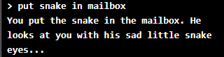
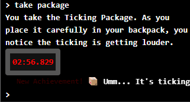
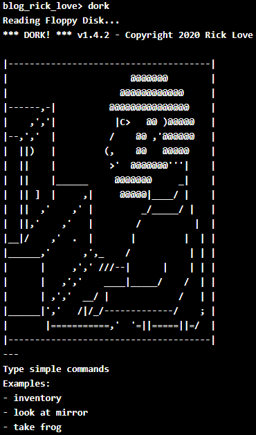

### Dork

Dork is a short text adventure inspired by Zork.

It's a game I made for my kids and my own enjoyment after playing with the original Zork source code.

It's full of ironic humor and interesting ways to die, just like a text adventure should be:

Plus a few modern features, like achievments:

And interactive elements:

It even has animated ascii art:

### Instructions

- Click on the blog header (the blinking cursor)
- type `ls`
- type `dork`
- Follow the instructions
- If you die, just type `dork` again to start over

### Repo

If you are interested in the source code: 

https://github.com/ricklove/rick-love-master/tree/master/code/games/dork

Also here is where I partially converted the original Zork source to Typescript:

https://github.com/ricklove/zork/tree/master/ts

