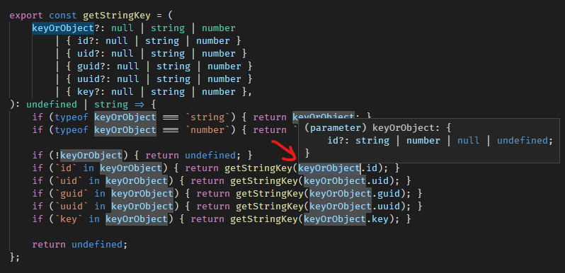
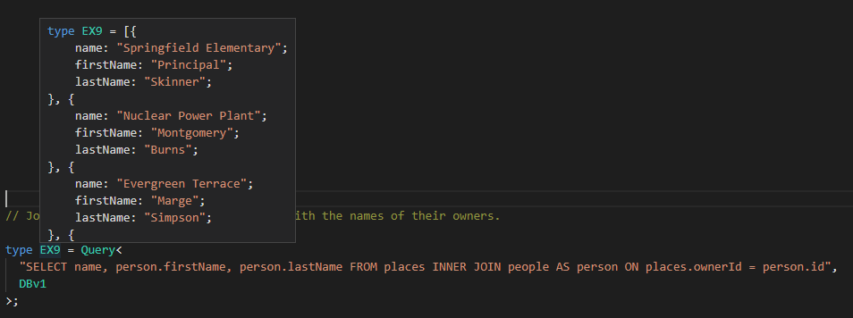

tl;dr: In Typescript, never use `any`


### `any` is evil

`any` is typescript's rebelious 19 year old who was doing 80 on an icy mountain road, drove off a cliff, bounced down the side of the mountain in a giant fireball, was thrown from the fireball car, landed in a frozen river, and was finally swept out to sea and eaten by sharks.

`any` is the implementation in typescript of the 'this is fine' meme. This gif is perfect:


* from: https://thoughtbot.com/blog/typescript-stop-using-any-there-s-a-type-for-that

### `any` => bugs

Why would you want `any` bugs in your code?

The type flow checker in typescript is your first line of defense against bugs. It is your most important tool to ensure correctness of your code.

`any` disables all type checking of any code that touches that variable.

That should sound bad. 

It is.

### What is the right way

- Use the minimal type (the part of the type you actually care about) - Duck Typing.
- Use a partial type.
- Use union types when it could be multiple types. Discriminated unions are great in typescript.
- Use `unknown` if you really have to. Then cast it to one of the above before you access it.

#### The Minimal Type - Duck Typing

Don't use the full type. Define only the fields you need to access in that scope.

For example, when you define a function, use a minimal definition for the argument types. Also, as a bonus that function is more generic and it is not coupled to a complex type. This simplifies your dependency graph and is one of the greatest advantages of Typescript over most other typed languanges: Typescript implements duck-typing.

```ts

// I only care about the id field
export const getKey = (item: { id: string }) => {
    return item.id;
};

// Got some junk here
const complexObject = {
    id: `ABC-012345`,
    got: () => `you`,
    too: `2` == 2 && 2 == true && `2` !== 2 && 2 !== true,
    much: () => { while (true) { complexObject.much(); } },
    stuff: [1, `42`, `false`, null, { undefined: true }],
    here: { latitude: 42, longitude: 42 },
};

// The complexity of the object doesn't matter
const key = getKey(complexObject);
console.log(`Here is the key`, { key, complexObject });

```

#### The Partial Type

In the case where an object should have a specific type, but it cannot be guaranteed, use partial typing.

Also in most cases, when the object fails to have the correct type, you can simply return `undefined` or `null`.

Below are a few patterns to do that depending on how you want to handle `null` and whether you want to support the whole parameter being optional.

I default to the first. If I discover that many callers would need to convert null to undefined, then I add `| null`.

```ts

// Basic optional field
export const getKeyWithOptionalId = (
    item: { id?: string },
) => {
    // Return type: string | undefined
    return item.id;
};

// Same as above using Partial Generic Type
export const getKeyWithPartialType = (
    item: Partial<{ id: string }>,
) => {
    // Return type: string | undefined
    return item.id;
};

// Support null or undefined field
// but return undefined instead of null
export const getKeyWithNullableId2 = (
    item: { id?: null | string },
) => {
    // Return type: string | undefined
    return item.id ?? undefined;
};

// Support null or undefined object
// but require the caller to provide something
export const getKeyWithNullableObject = (
    item: null | undefined | { id?: null | string },
) => {
    // Return type: string | undefined
    return item?.id ?? undefined;
};

// Support optional parameter
export const getKeyWithOptionalArgument = (
    item?: null | { id?: null | string },
) => {
    // Return type: string | undefined
    return item?.id ?? undefined;
};


```

Here is a more complex example:

```ts

export const getKeyFromObject = (
    obj?: {
        id?: string;
        uid?: string;
        guid?: string;
        uuid?: string;
        key?: string;
    }
) => {
    return obj?.id
        ?? obj?.uid
        ?? obj?.guid
        ?? obj?.uuid
        ?? obj?.key;
};

```

##### Side Note: null vs undefined

On the difference between `undefined` and `null`. They should be treated the same logically in your code.

However, I do sometimes use them to distinguish intent in the code:

- `undefined` to indicate an empty optional field - i.e. it doesn't exist and that's normal
- `null` to indicate the default value - i.e. an object that normally should have value, but is not initialized yet

However, those differences are subtle and it may be better to just use undefined for everything. Logically they should be treated the same in most cases.

In fact, the only place I have seen a logical difference between them is when updating an object in a storage system: 

- `undefined` could mean ignore the field (no change) 
- `null` could mean reset that field (remove the value)

However, that pattern is likely to introduce bugs so be careful. Thankfully, typescript keeps track of each and allows you to specify if one or the other is required.

#### Union Types

With union types, we are starting to use Typescript's real power.

A union type is essentially the or operator (`|`) for types: i.e. it's a type that could be any of multiple types.

Typescript handles union types like a pro. It understands all the runtime operations that could constrain a type and protects you from mistakes. For example, an `if` statement can be used to constrain the type to a specific possibility.

In the below example, `keyOrObject` could be a `string`, `number`, `null`/`undefined`, or an object with one of many possible id fields.

```ts

export const getStringKey = (
    keyOrObject?: null | string | number
        | { id?: null | string | number }
        | { uid?: null | string | number }
        | { guid?: null | string | number }
        | { uuid?: null | string | number }
        | { key?: null | string | number }
): undefined | string => {
    if (typeof keyOrObject === `string`) { return keyOrObject; }
    if (typeof keyOrObject === `number`) { return `${keyOrObject}`; }

    if (!keyOrObject) { return undefined; }
    if (`id` in keyOrObject) { return getStringKey(keyOrObject.id); }
    if (`uid` in keyOrObject) { return getStringKey(keyOrObject.uid); }
    if (`guid` in keyOrObject) { return getStringKey(keyOrObject.guid); }
    if (`uuid` in keyOrObject) { return getStringKey(keyOrObject.uuid); }
    if (`key` in keyOrObject) { return getStringKey(keyOrObject.key); }

    return undefined;
};

```

And here is the type when you hover over the object after being constrained by one of the if statements:



As you can see, inside the `if` body, the compiler know which specific type the `keyOrObject` must be.


Also, you can combine the union objects into a single partial object which can reduce the branching:

```ts

// Same as above
export const getStringKey = (
    keyOrObject?: null | string | number
        | {
            id?: null | string | number;
            uid?: null | string | number;
            guid?: null | string | number;
            uuid?: null | string | number;
            key?: null | string | number;
        }
): undefined | string => {
    if (typeof keyOrObject === `string`) { return keyOrObject; }
    if (typeof keyOrObject === `number`) { return `${keyOrObject}`; }

    return getStringKey(
        keyOrObject?.id
        ?? keyOrObject?.uid
        ?? keyOrObject?.guid
        ?? keyOrObject?.uuid
        ?? keyOrObject?.key
    );
};

```

#### Unknown

`unknown` is the little brother of `any`. Having grown up with the embodiment of a "Don't Do Drugs" campaign, `unknown` is not interested in the "freedom" of his evil brother.

`unknown` is safe. If you ask him to hold a baby, he won't drop kick it through a field goal or throw it into a lake.


(Bonus points if you have played Peasant's Quest - Note: the baby turns out ok.)

So when should you use `unknown`? Rarely - in fact it is difficult to come up with a good example where one of the above won't work much better.

Here is an example where it just doesn't matter what the type is because it is immedietely converted to json:


```ts

export async function webRequest(
    url: string,
    data: unknown,
    options?: { method: 'POST' | 'PUT' },
) {

    const body = JSON.stringify(data);
    const reqData = {
        method: options?.method ?? `POST`,
        headers: {
            'Accept': `application/json`,
            'Content-Type': `application/json`,
            'Content-Length': `${body.length}`,
        },
        body,
    };

    throw new Error(`Not Implmented`);
}

```

### Other Articles about any

- https://thoughtbot.com/blog/typescript-stop-using-any-there-s-a-type-for-that
- https://codeburst.io/five-tips-i-wish-i-knew-when-i-started-with-typescript-c9e8609029db


#### Fun Side Note: Insanely Precise Typing

Typescript is the most precisely typed languange that exists and it gets more powerful constantly.

Some people have taken that to the level of insane:



Let me explain what is happening in that screen shot:

Typescript (4.1) is parsing a raw string and determining:

- An sql join calculation
- The fields returned by that query
- Dot operator object navigation of those fields
- Specific result values (as string constants) when that query is applied against an object literal

Let me emphasize this. Typescript doesn't have a single line of code that knows anything about SQL. This demo was made just to demonstrate that typescript can rip apart raw string constants and understand type information from the contents of that string. This is done with a combination of typescript's conditional typing and it's support for string literals soon coming in Typescript 4.1.

Here is the project: https://github.com/codemix/ts-sql

Typescript Typing Level: Insane

