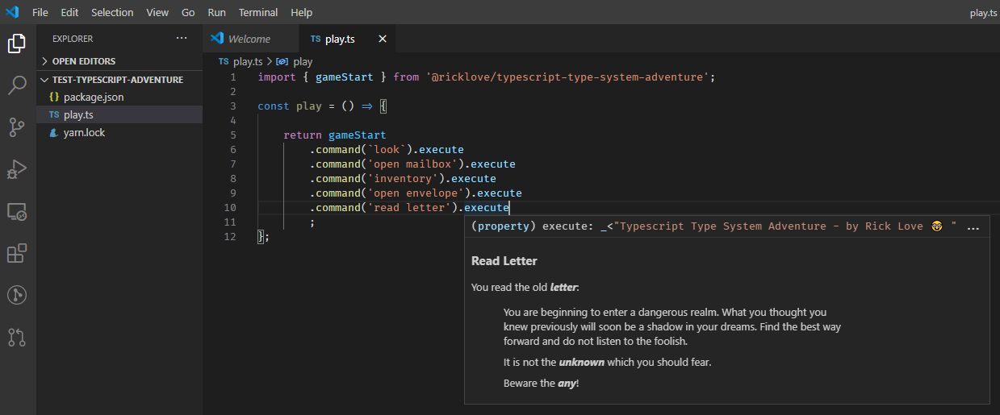
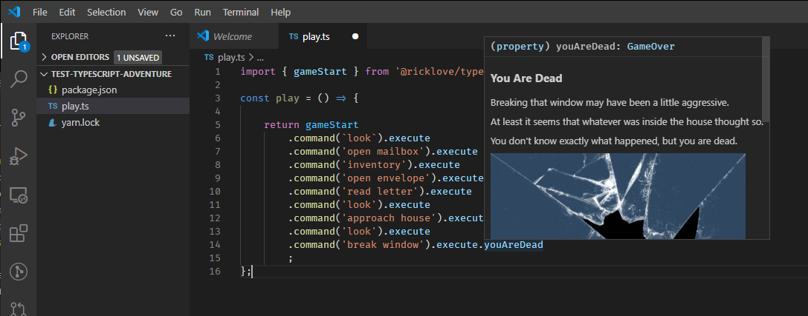
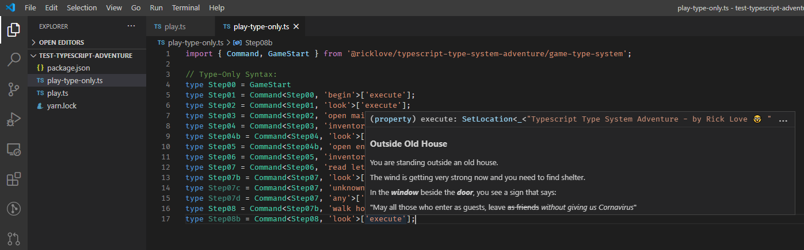
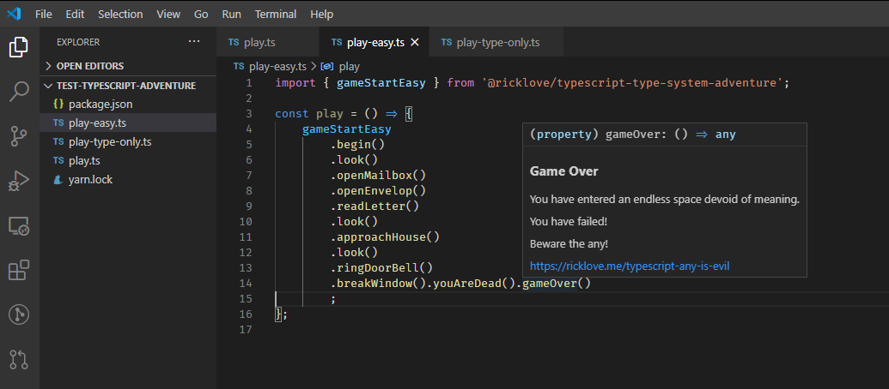

tl;dr: Play a text adventure in vscode with the typescript type system.

### Summary

This is a level 99 typescript wizardry demo.

### How to play

- create an empty npm project:
    - `mkdir play-typescript-adventure`
    - `cd play-typescript-adventure`
    - `npm init`
- Install the npm package:
    - `npm install @ricklove/typescript-type-system-adventure`
    - OR `yarn @ricklove/typescript-type-system-adventure`
- Open this folder in vscode:
    - `code`
- Create a new typescript file with the following content:
    - `play.ts`

```ts
import { gameStart } from '@ricklove/typescript-type-system-adventure';

const play = () => {

    return gameStart
        .command('look').execute
};

```
- Place you cursor at the end of execute, and enter a new command on the next line

### Tips:

- Hover over `.execute` to see the game output tooltip
- `.command('look').execute` will give you an idea of what to do next
- `.command('help').execute` if you get stuck
- If you really get stuck, just hit F12 and read the source code

### Screenshots










