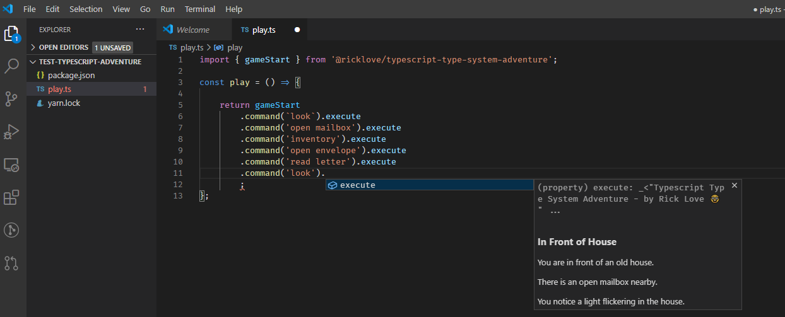

tl;dr: Play a text adventure in vscode with the typescript type system.

### Summary

I've always been a fan of text adventures since I first played Space Quest 1 when I was about 6 (though it was a graphical text adventure technically).

I've also always been a huge fan of typescript since it came out in 2012.

Now, since Typescript 4.1 is adding the powerful template-literal-types, I figured I could do something fun with them.

(I got the idea from here: https://github.com/codemix/ts-sql)

It occured to me, "Hey! Why not a text adventure!"

Now, it turns out that the way I implemented this game, I don't need the 4.1 features. I'll probably add that in the future to support more dynamic command parsing.

If you have `vscode`, you can play now with a quick `npm install` into any node project. (See below for full installation instructions.)

### So What?

This is a level 99 typescript wizardry demo. 

If you aren't a typescript nerd, you might miss the significance of this, but here is the basic idea:

First of all, everything you see here is running in the vscode code editor (without any program running). In fact, you can't even run my code. If you compile it to javascript, this is what you will get:

```ts
export const gameStart = null;
```

(There might be a little more debris then that, but you get the idea.)

This screenshot should make it clear that the typescript type system is doing all the work:


However, it's not very convenient to declare all those StepNN types, so I made a fluent mode that reduces the need for those:


There is also an easy mode that uses only an object tree. It was very easy to make, but autocomplete ruins the fun by giving all the answers away. 


In the process of making the game, I discoved that vscode supports jsdoc markdown. So I decided to use that for the game output since it is so rich. It even supports images:


### Features

- Play in vscode using autocomplete and tooltips
- Game output displayed in tooltips using jsdoc3 with markdown (including gifs)
- Implemented using conditional types, string literals, and a minimal state machine

### How to play

- `npm i @ricklove/typescript-type-system-adventure`
- Create a new `play.ts` file and add the below code
- Hover over `execute` to see game output (see screenshots for examples)

```ts
import { gameStart } from '@ricklove/typescript-type-system-adventure';

const play = () => {

    return gameStart
        .command('look').execute
};

```

### Tips:

- `.command('look').execute` will give you an idea of what to do next
- `.command('help').execute` if you get stuck
- If you really get stuck, just hit F12 and read the source code
- You can also play the easy mode with this starter:

```ts
import { gameStartEasy } from '@ricklove/typescript-type-system-adventure';

const playEasyMode = () => {
    gameStartEasy
        .begin()
        .look()
};

```

### Screenshots





### Source Code

https://github.com/ricklove/rick-love-master/tree/master/code/typescript-type-system-adventure