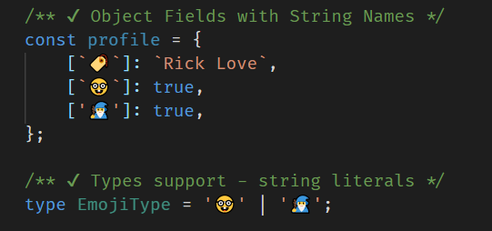

tl;dr: A quick update on the state of support for using emojis in the worst places: variable names

### Summary

It looks like the options are limited to within string contexts. Furtunately for those who want the most unreadable code ever, it is possible to at least name all your object fields with emojis.



```ts

/** ❌ variable declarations */
// const 😾 = false;
// const _😥 = false;
// const [`_😥`] = false;

/** ❌ function declarations */
// export function _😾  () { };

/** ❌ function parameters */
// export function o_o (😾: boolean) { };

/** ✔ function parameter literal string type */
export function o_o(cat: '😺') { };

/** ✔ Object Fields with String Names */
const profile = {
    [`🏷️`]: `Rick Love`,
    [`🤓`]: true,
    ['🧙‍♂️']: true,
};

/** ✔ Types support - string literals */
type EmojiType = '🤓' | '🧙‍♂️';

/** ✔ Emoji Enum */
enum EmojiEnum {
    [`🏷️`] = `🏷️`,
    [`🤓`] = `🤓`,
    ['🧙‍♂️'] = '🧙‍♂️',
}
const emojiEnum = EmojiEnum[`🏷️`];

/** ❌ export */
// export { profile[`🏷️`] as 🏷️ };

/** ❌ catch error parameter name */
// const tryCatchBlock = () => {
//     try {
//         const ok = true;
//     } catch (🥵) {
//     }
// };

```

### Most Destruction Possible

If you really want to have fun, make sure to use the zero-width-space in combination with string emoji fields:

```ts

/** ### Have Fun! 
 * 
 * - Note: these are not the same
 * - Hint: zero-width-space
*/
const criticalSwitch = (value: '😇' | '​😇' | '😇​' | '​') => {
    switch (value) {
        case '😇': return '😳';
        case '​😇': return '​😳';
        case '😇​': return '😳​';
        case '​': return '​';
        default: return '';
    }
};

```

### Conclusion

You're welcome!

