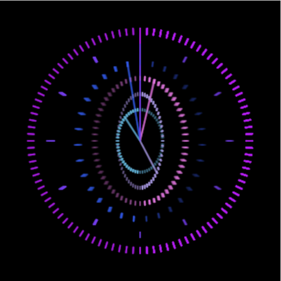

NFTs are revitalizing the ability for artists to make income. It also allows a software engineer like me the chance to create procedurally generated art defined in code.

Code is my medium of creation, so this is my chance to make something that shines.

Recently, I noticed an interesting symmetric time that 1/21/21 21:21:21 would be occuring soon (this is using the month/date/year format, but that still counts).

So, in a rush I'll be publishing my first crypto art NFT - using the ERC721 standard NFT smart contract base.

However, as a bonus the goal is to mine this exactly at the right second. Hopefully, the community will help and we will be able to capture this unique moment in our human timeline.

[View the live art as it ticks to 1/21/21 21:21:21.](/art)

